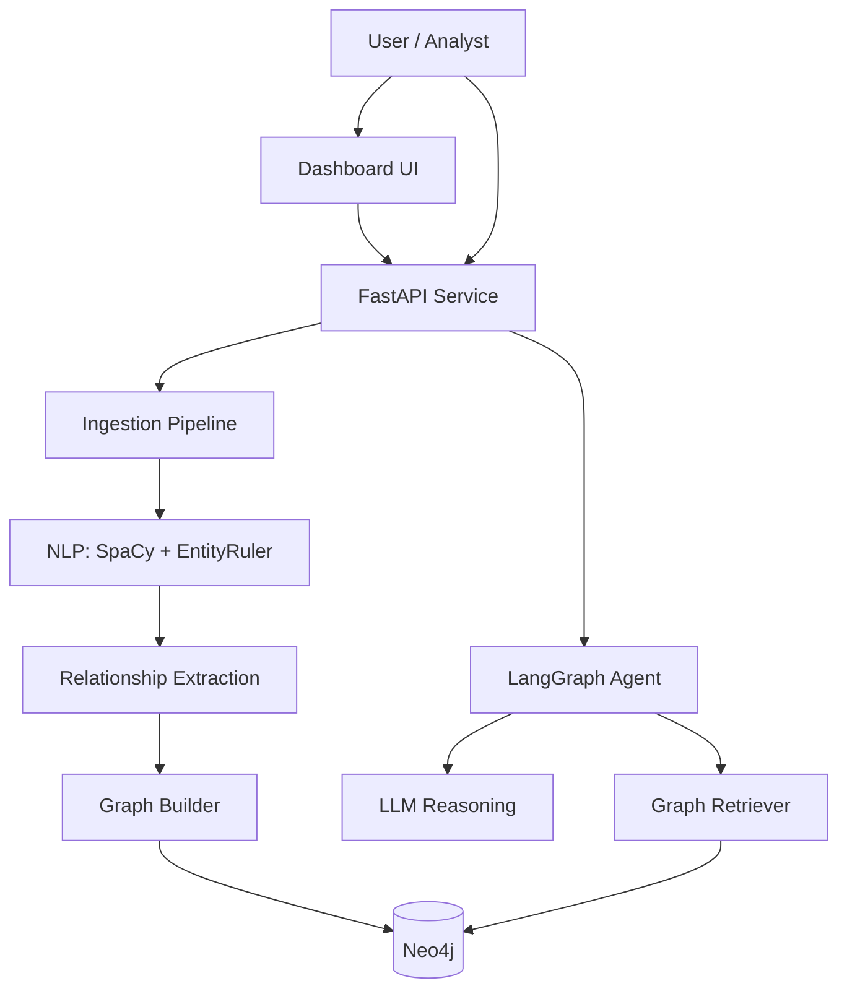
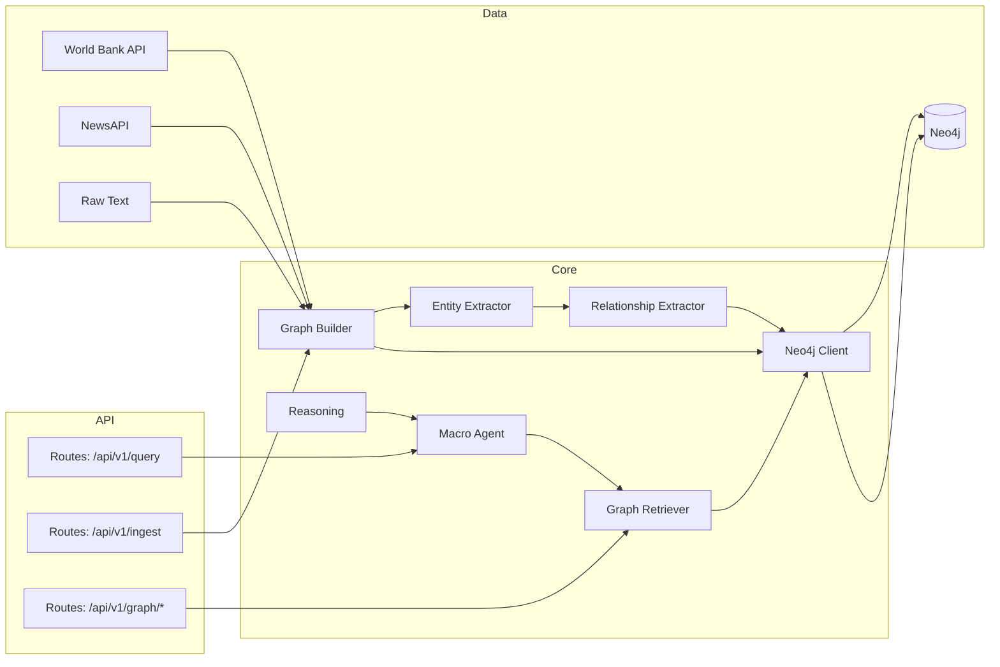
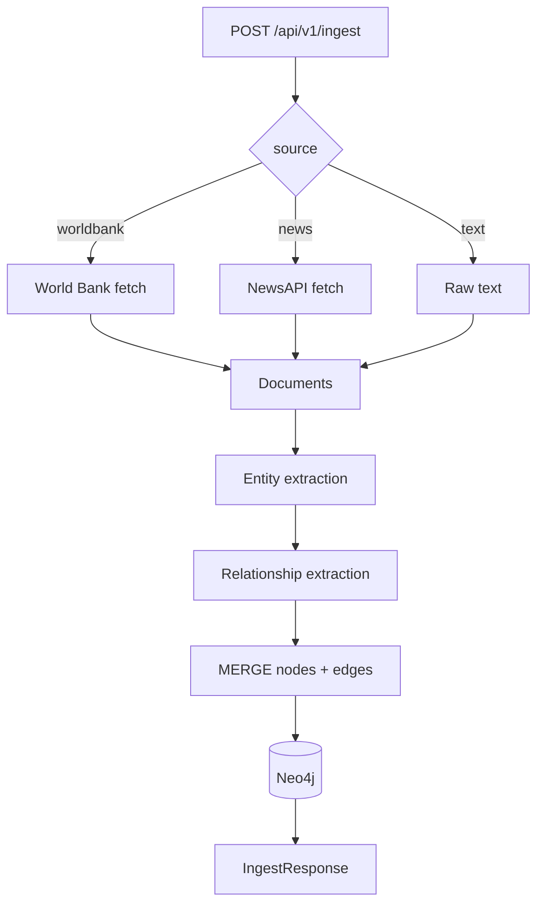
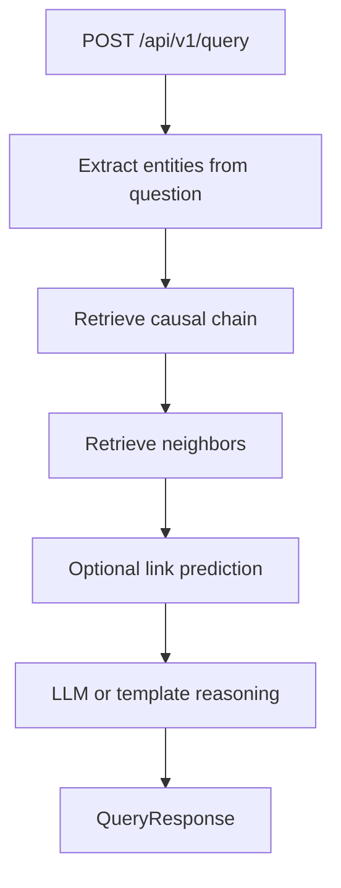
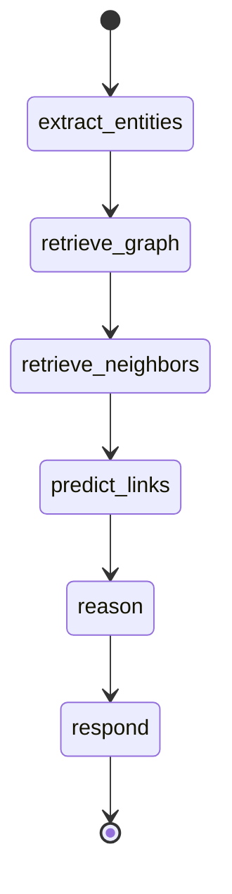

# AI Economic Knowledge Graph

AI-powered macroeconomic knowledge graph for India. Ingests data from the
World Bank, NewsAPI, or raw text, extracts entities and causal relations,
stores them in Neo4j, and answers natural-language questions with explainable
causal chains.

## What this includes

- FastAPI service with ingestion, query, and graph inspection endpoints.
- LangGraph agent that retrieves graph context and produces explainable
	answers using LLM reasoning (with a deterministic fallback).
- Neo4j-backed knowledge graph with causal relationships.
- Simple dashboard UI for querying and graph visualization.

## Architecture overview



## UML-style component view



## Ingestion flow



## Query flow



## LangGraph state machine



## Data model notes

- Nodes represent macroeconomic entities like `GDP`, `Inflation`, `RBI`,
	`Repo Rate`, `NIFTY`, `Bond Yield`.
- Relationships are directional and use a constrained set of types:
	`CAUSES`, `IMPACTS`, `LEADS_TO`, `CORRELATES_WITH`, `AFFECTS`.
- Graph writes use `MERGE` to avoid duplicates.

## API endpoints

- `POST /api/v1/ingest`
	- Body: `{ "source": "worldbank" | "news" | "text", "content": "..." }`
	- Returns ingestion summary: docs, entities, relationships.
- `POST /api/v1/query`
	- Body: `{ "question": "Why did NIFTY fall?" }`
	- Returns insight, causal chain, sources.
- `GET /api/v1/graph/summary`
	- Returns node/relationship counts and top connected nodes.
- `GET /api/v1/graph/chain/{entity}`
	- Returns the causal chain for a given entity.
- `GET /api/v1/graph/search?q=keyword`
	- Keyword search for entities.
- `GET /api/v1/graph/visualize?limit=100`
	- Nodes and edges formatted for D3.js.
- `GET /health`
	- Neo4j connectivity + graph summary.
- `GET /dashboard`
	- Dashboard UI.

## Setup

### 1) Environment variables

Create a `.env` file in the project root:

```ini
NEO4J_URI=neo4j://localhost:7687
NEO4J_USERNAME=neo4j
NEO4J_PASSWORD=password
NEO4J_DATABASE=neo4j

OPENAI_API_KEY=
GROQ_API_KEY=
NEWS_API_KEY=

DEMO_SEED=true
LOG_LEVEL=INFO
```

Notes:
- If no LLM key is set, the pipeline uses deterministic rules.
- If `NEWS_API_KEY` is missing, sample news is used.

### 2) Install dependencies

```bash
python -m venv .venv
source .venv/bin/activate
pip install -r requirements.txt
python -m spacy download en_core_web_sm
```

### 3) Run the API

```bash
uvicorn main:app --reload
```

Open:
- Swagger docs: http://localhost:8000/docs
- Dashboard: http://localhost:8000/dashboard

## Example requests

```bash
curl -X POST http://localhost:8000/api/v1/ingest \
	-H 'Content-Type: application/json' \
	-d '{"source":"worldbank"}'

curl -X POST http://localhost:8000/api/v1/query \
	-H 'Content-Type: application/json' \
	-d '{"question":"Why did NIFTY fall?"}'
```

## Repository layout

```
agent/          LangGraph macro agent
api/            FastAPI routers and models
config/         Settings and environment handling
graph/          Neo4j client, builder, retriever
ingestion/      World Bank + NewsAPI fetchers
nlp/            SpaCy entity extraction and relation logic
reasoning/      LLM-based reasoning and fallback templates
static/         Dashboard UI
```